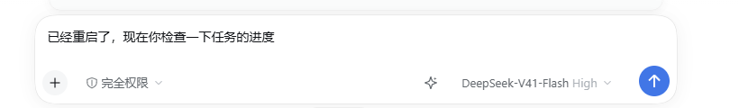

# dsh-prompt-optimization-master

**Author: Kirin ([ruiyukirin](https://github.com/ruiyukirin))**

A **prompt optimization** button for the DeepSeek Harness composer: one click
rewrites the unsent draft into a clearer, more specific prompt; click again to
restore the original.

The mechanism follows Tencent WorkBuddy's EnhancePrompt feature.

[中文说明 →](README.md)

---

## Install

```bash
dsh plugin --profile web add github:ruiyukirin/dsh-prompt-optimization-master
```

> **About the name**: `dsh-prompt-enhance` and `dsh-prompt-optimizer` were both
> already taken on npm and GitHub by plugins with the same product intent, so this
> one uses `dsh-prompt-optimization-master`. The name was checked against npm and
> GitHub before release and was free in both places.

---

## What it does

A ✨ button appears in the composer toolbar, between the model selector and the
send button:

| State | Icon | What a click does |
|---|---|---|
| Draft present, idle | ✨ | Sends the draft to the model; the rewrite replaces the composer content |
| Enhancing | ⏳ | **Cancels**, aborts the request and restores the original |
| Enhanced | ↩️ | **Restores the original** |

- **Appears only once you type.** An empty draft hides the button, exactly like
  WorkBuddy. Invisible placeholders (zero-width space, `U+200B`) do not count as
  content.
- **Hidden while the composer is busy.** During `submitting` / `adjudicating` the
  button hides so a click cannot fire a pointless request — but a result that is
  still revertible stays reachable, so a pending restore is never locked away.
- **Editing retires the backup.** If you change the draft after an enhancement,
  "restore original" steps aside instead of swallowing your edit.
- **Per-session state.** Switching sessions drops the previous session's backup
  and error banner.
- **No conversation context is consumed.** The enhancement is an independent
  model call: it creates no Session, writes nothing to the session log, and
  **does not read conversation history** — it sees only the fixed prompt plus the
  current draft. WorkBuddy behaves the same way.

---

## In action

The same draft, before and after one click on ✨:

| Before | After |
|---|---|
|  |  |

The draft「已经重启了，现在你检查一下任务的进度」became a task statement that names every
item to check; the ✨ turned into a ↶ (restore original) at the same time.

---

## Settings

**Settings → Prompt optimization** — its own entry in the settings sidebar, next
to the other sections:

| Setting | Effect |
|---|---|
| **Enable the ✨ button** | Switched off, the button disappears from the composer. Come back here any time to turn it on again |
| **Minimum characters** | The button hides while the draft is shorter than this. Empty = follow the host default |
| **Use a specific model** | Follows the current session model by default. When enabled, type a provider and model id — so this auxiliary call can be pinned to a cheaper model **without changing what your conversation uses** |

Settings live in browser local storage, so **reinstalling the plugin does not
lose them**.

## Language

Button text follows the harness UI language (Settings → Language). Simplified
Chinese and English are built in, served through the harness locale service
rather than hard-coded strings.

---

## How it works

```
[composer draft]
    ↓ useInput(s => s.draft)
[✨ button]  (slot: conversation.input.right)
    ↓ POST /dsh-prompt-enhance/enhance
[host half]  ctx.llm.stream({ system, messages })   ← independent call, no Session
    ↓ accumulate text-delta chunks
[write back]  inputActions.setDraft(text)
    + the original is kept as a backup, restorable in one click
```

The bridge is the plugin's own HTTP route rather than the harness Remote
(typert) channel. The desktop UI is served over the custom `dsh-app://` scheme;
Electron forwards every non-asset path to the host HTTP server, but that
forwarding function requires the request header `Origin: dsh-app://app`. A
host-side check must accept that origin explicitly, otherwise every desktop
request is answered with 403.

### Prompt design

Two layers, following WorkBuddy:

1. **system** — the role: a prompt engineering expert serving a general-purpose
   coding/operations agent. It lists what *not* to do (no how-to guides, no code
   snippets the user never asked for, no technologies the user never mentioned,
   do not answer the question — rewrite it more precisely), plus the **~800
   character ceiling** and two English few-shot examples.
2. **user** — the task template with a **language lock as the highest priority**,
   a bad-output/good-output pair that suppresses meta commentary about language,
   and three mixed-language few-shot examples.

The result is cleaned before use: Markdown fences and leading/trailing quote
characters are stripped.

---

## Layout

| Path | Role |
|---|---|
| `dsh/index.js` | Host half: routes, prompts, model call, cancellation, error codes |
| `client/client.js` | Client half: the three-state button, settings popover, i18n |
| `cordis.patch.yml` | The single insert that mounts this package |
| `test/smoke.mjs` | Host half offline smoke test (45 checks) |
| `test/client.test.mjs` | Client half state-machine test (57 checks, real code in a sandbox) |
| `docs/` | Research reports: WorkBuddy internals, naming, mechanism diff, go-to-market |

---

## Development constraints (measured, not guessed)

- **Client half changes → refresh the page.** HMR pushes a module only the first
  time it joins the client module graph; later edits are not pushed.
- **Host half changes → restart DSH.** The Loader caches the imported plugin
  module for the process lifetime. All of these were tried and none re-imports
  the module: disabling/re-enabling the plugin, re-applying the bundle, and
  rewriting the profile's `cordis.patch.yml`.

### Offline tests

```bash
npm test        # both suites, no DSH required
```

- **Host half** (`test/smoke.mjs`): a fake Cordis context plus a real HTTP server.
  Covers route registration, the request guard (including the `dsh-app://app`
  origin), prompt assembly, chunk accumulation, result cleaning, every error
  code, cancellation, model overrides, and a missing llm service.
- **Client half** (`test/client.test.mjs`): loads the real `client/client.js`
  through `node:vm` with a minimal React and a stubbed fetch, then drives the
  button through every transition — hidden on empty draft, enhance, revert,
  cancel, failure restore, settings effects, model override, i18n, and the
  settings popover.

---

## Findings worth keeping

| Finding | Detail |
|---|---|
| **`ctx.llm` cannot be read directly** | Cordis throws `cannot get property "llm" without inject`. Use `ctx.get('llm')` or declare `inject`. The smoke test now reproduces that guard so a regression cannot slip through. |
| **Reasoning can eat the whole output budget** | Measured on `deepseek-flash`: one short rewrite emitted 132 characters of visible text after **2632 characters of reasoning**. A 512-token budget was consumed entirely by reasoning and produced no visible output, so the cap is 4096 and a budget hit is reported as `truncated` — a cut-off prompt is worse than no rewrite. |
| **Business errors are not HTTP errors** | The host answers `{ok:false, code}` with HTTP 200. The client once cleared its in-flight request id before validating, so the catch treated the error as a superseded request and **the button span forever**. Fixed and locked with a test. |
| **`setDraft` replaces the whole draft** | Per the harness source: it replaces the entire draft, splits newlines into paragraphs, and leaves the caret at the end. |
| **Zero-width space counts as content** | The editor inserts `U+200B` as an invisible placeholder and `trim()` does not remove it, so a draft that looks empty could still fire a request. Now stripped before measuring. |
| **Desktop origin is `dsh-app://app`** | Electron forwards non-asset paths to the host HTTP server but requires that exact origin; a strict same-origin check answers 403 for every desktop request. |

> ⚠️ Do not rewrite a UTF-8 file with shell `Get-Content` / `WriteAllText` on
> Windows: PowerShell decodes BOM-less UTF-8 as ANSI, turning comments into
> mojibake and eating newlines. Use an editor that guarantees UTF-8.

## License

MIT
