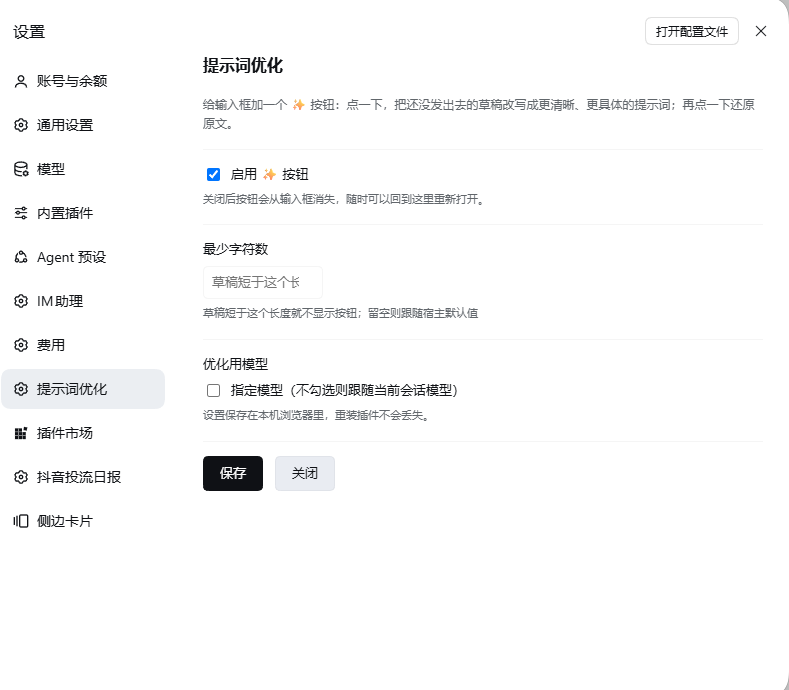

# dsh-prompt-optimization-master

**作者：Kirin（GitHub: [ruiyukirin](https://github.com/ruiyukirin)）**

给 DeepSeek Harness 的输入框加一个**提示词优化**按钮：点一下，把还没发出去的草稿
改写成更清晰、更具体的提示词；再点一下，还原原文。

机制参考腾讯 WorkBuddy 的 EnhancePrompt（增强提示词）功能。

[English →](README.en.md) ｜ [更新日志 →](CHANGELOG.md)

---

## 安装

```bash
dsh plugin --profile web add github:ruiyukirin/dsh-prompt-optimization-master
```

也可以从 [Releases](https://github.com/ruiyukirin/dsh-prompt-optimization-master/releases) 下载 tarball（压缩包）安装：

```bash
dsh plugin --profile web add "https://github.com/ruiyukirin/dsh-prompt-optimization-master/releases/download/v0.2.0/dsh-prompt-optimization-master-0.2.0.tgz"
```

> **关于名字**：`dsh-prompt-enhance` 与 `dsh-prompt-optimizer` 在 npm 和 GitHub 上都已被
> 他人占用（且是同一产品定位），所以本插件改用 `dsh-prompt-optimization-master`，
> 发布前已逐项核查 npm 与 GitHub 三处均无占用。

---

## 它能干什么

在输入框工具栏右侧（模型选择器与发送按钮之间）出现一个 ✨ 按钮：

| 状态 | 图标 | 点击效果 |
|---|---|---|
| 有草稿、空闲 | ✨ | 把草稿发给模型改写，结果直接替换输入框 |
| 优化中 | ⏳ | **取消**，中止请求并还原原文 |
| 已优化 | ↩️ | **恢复原文** |

- **输入了才出现**：草稿为空时按钮自动隐藏——和 WorkBuddy 一样。
  隐形占位符（零宽空格 `U+200B`）不算内容，不会被误判成"有输入"。
- **输入框忙的时候不出现**：输入框正在提交/仲裁（`submitting` / `adjudicating`）时隐藏，
  避免点出一个白跑的请求；但**已优化过的结果仍可还原**，不会被锁死。
- **改过就失效**：优化之后如果你又手动改了草稿，"恢复原文"会自动退休，
  不会把你后来的修改吞掉。
- **切会话自动复位**：切换会话后，上一个会话的备份与错误提示不会残留。
- **不占对话上下文**：优化走的是独立的模型调用，不创建会话、不写入会话记录，
  **也不读对话历史**——只看「固定提示词 + 当前草稿」。这一点与 WorkBuddy 一致。

---

## 效果

同一段草稿，点一下 ✨ 之后：

| 优化前 | 优化后 |
|---|---|
|  |  |

草稿从「已经重启了，现在你检查一下任务的进度」被改写成一条目标明确、把要检查的几项
都点名的任务说明；右侧的 ✨ 同时变成了 ↶（还原原文）。

## 设置

**设置 → 提示词优化**——设置面板左侧栏里的一个独立条目，和「费用」「插件市场」「侧边卡片」并列：

| 项 | 说明 |
|---|---|
| **启用 ✨ 按钮** | 关掉后按钮从输入框消失。随时可以回到这一页重新打开 |
| **最少字符数** | 草稿短于这个长度就不显示按钮。留空 = 跟随宿主默认值 |
| **指定模型** | 默认跟随当前会话模型。勾选后可填提供方 provider 与模型 ID——**这个辅助调用能固定到便宜模型上，不影响你对话本身用哪个模型** |



设置存在浏览器本地存储里，**重装插件不会丢**。

## 语言

按钮文案跟随 DSH 的界面语言（设置 → 语言），内置**简体中文与英文**两套。

走的是 DSH 官方 locale（本地化）服务，不是硬编码字符串。

---

## 工作原理

```
[输入框草稿]
    ↓ useInput(s => s.draft)
[✨ 按钮]（conversation.input.right 插槽）
    ↓ POST /dsh-prompt-enhance/enhance
[宿主半]  ctx.llm.stream({ system, messages })   ← 独立调用，不入会话
    ↓ 拼接 text-delta 分片
[写回输入框]  inputActions.setDraft(text)
    ＋ 原文存进备份，可一键还原
```

用的是插件自己的 HTTP 路由，不是 Remote。原因：桌面版界面跑在 `dsh-app://` 协议上，
Electron 会把非静态资源的路径**全部转发**给宿主 HTTP 服务，所以相对路径 `fetch` 是通的
——但转发函数强制要求请求头 `Origin: dsh-app://app`，宿主侧的同源校验必须显式接受它，
否则桌面版下会全部 403。

### 提示词设计

两层结构，沿用 WorkBuddy 的思路并做了适配：

1. **system** —— 角色设定：提示词工程专家，服务于一个通用的编码/操作型 AI 助手。
   明确列出该做什么、不该做什么（不许写教程、不许要代码片段、不许提用户没提的技术栈、
   不许回答问题而要把问题改得更精确）。
2. **user** —— 任务模板 + 少样本示例。核心是**语言锁定为最高优先级**，
   外加一组"坏输出 vs 好输出"对照，专门压制"用户输入是中文 → 应该用中文回复"
   这类元话术。

结果还会做清洗：剥掉模型爱加的 Markdown 围栏和首尾引号。

---

## 结构

| 路径 | 作用 |
|---|---|
| `dsh/index.js` | 宿主半：路由、提示词、模型调用、取消与错误码 |
| `client/client.js` | 客户端半：三态按钮 |
| `cordis.patch.yml` | 装载该插件的一行 insert |
| `test/smoke.mjs` | 宿主半离线冒烟测试（45 项检查） |
| `test/client.test.mjs` | 客户端半状态机测试（57 项检查，沙箱里跑真实代码） |
| `docs/` | 调研报告：WorkBuddy 机制、命名诊断、机制对比、发布策略 |
| `docs/阶段0-探针结论.md` | 插槽契约实测记录 |

---

## 实测记录（都踩过）

下面这些不是推测，是在真机上验证/踩坑得来的：

| 发现 | 说明 |
|---|---|
| **`ctx.llm` 不能直接访问** | Cordis 会抛 `cannot get property "llm" without inject`。必须用 `ctx.get('llm')` 或声明 `inject`。已修，并且冒烟测试现在会**模拟这个守卫**，防止回归。 |
| **推理会吃光输出预算** | 实测 `deepseek-flash`：一次短改写输出了 132 字符可见文本，但**推理花了 2632 字符**。512 token 的预算会全被推理吃掉、可见输出为 0。所以输出上限提到 4096，并把"触发上限"单独报成 `truncated`——截断的提示词比不优化更糟。 |
| **`setDraft` 是整体替换** | 官方源码注释：*Replace the whole draft; newline 分段；光标落到末尾*。 |
| **业务错误不能用 HTTP 状态判断** | 宿主的错误是 HTTP 200 + `ok:false`。客户端一度在这里提前清空了请求 id，导致 catch 把它当成"已被新请求取代"而直接返回——**模型一失败按钮就永久转圈**。已修，客户端测试锁死。 |
| **桌面版 Origin 是 `dsh-app://app`** | Electron 会把非静态资源路径全部转发给宿主 HTTP 服务，但强制要求这个 Origin。严格同源校验在桌面版会全部 403。 |
| **零宽空格会被误判成"有输入"** | 编辑器会塞入隐形占位符 `U+200B`，而 `trim()` 不会去掉它。WorkBuddy 会先剔除再计数；本插件原先没剔，导致草稿"看起来是空的"却能点按钮并发出无意义请求。已修（含测试）。 |
| **照搬提示词时会漏条款** | 双层提示词里，`TASK_PROMPT` 是 WorkBuddy 的逐字照搬（字符级只差 4 处），但 `SYSTEM_PROMPT` 漏了「约 800 字符」的长度上限和 2 组英文少样本——没有上限，模型会把一行需求写成多段小作文。已补回。 |

## 开发时的两个硬约束（实测，不是猜的）

- **客户端半改动 → 刷新页面。** HMR 只在模块首次加入模块图时推送一次，之后的改动不会自动推。
- **宿主半改动 → 重启 DSH。** Loader 会把插件模块缓存在进程里。以下三种方式都实测过，
  都不会重新导入模块：禁用/启用插件、重新应用 bundle、改写 profile 的 `cordis.patch.yml`。

所以调这个插件时，客户端改动刷新即可，宿主改动要重启一次。

### 离线测试

```bash
npm test        # 不需要 DSH，两套测试一起跑
```

- **宿主半**（`test/smoke.mjs`）：假 Cordis ctx + 真 HTTP 服务，覆盖路由注册、请求守卫
  （含 `dsh-app://app` 源）、提示词组装、分片累积、结果清洗、全部错误码、取消、
  以及 llm 服务缺席。
- **客户端半**（`test/client.test.mjs`）：用 `node:vm` 把真实的 `client/client.js`
  跑起来，配一个极简 React 与假 fetch，驱动按钮走完全部状态转换——空草稿隐藏、
  增强、还原、取消、失败还原、宿主未加载提示，以及"手动改动后备份失效"。

### 无头调试技巧

拿不到浏览器控制台时，可以让客户端把数据写进 `localStorage`，再从磁盘上的 leveldb 读：

```
C:\Users\yuqil\AppData\Roaming\@deepseek-ai\dsh-desktop\Local Storage\leveldb
```

`.wb-research/read-ls.mjs` 是配套的取值脚本。

> ⚠️ 注意：**不要用 shell 的 `Get-Content` / `WriteAllText` 改写 `cordis.patch.yml`**。
> Windows PowerShell 会按 ANSI 解码无 BOM 的 UTF-8 文件，一读一写就把中文注释变成乱码，
> 还可能吃掉换行导致 YAML 解析失败。要改就用能保证 UTF-8 的编辑工具。

## 许可

MIT
